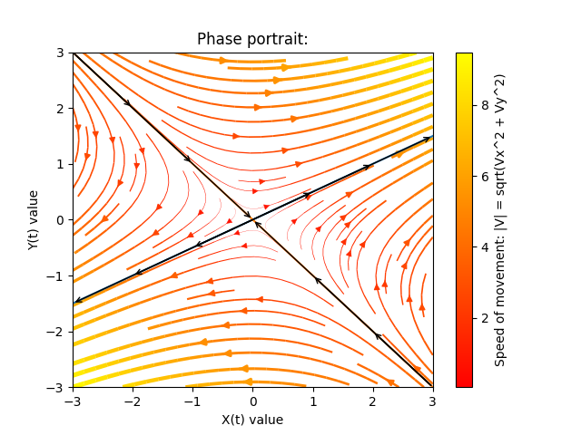

# Differential-Equation-Plotting

# TODO
Goals for this code:

1) draw phase prtrait of non-linear systems of 2D coupled differential equations
2) find the Jacobian matrix of these systems
3) be able to trace a single curve in the system using a numerical method of choice
4) plot any eigenvectors

TODO: Write documentation

## How to use this code

```python
def plot(blaah=blaah)

plot(blaah=foo, ...)

```

Result:
<div align="center">

</div>


# Credits

This code was inspired by the Fall 2017 Math 125 Ordinary Differential Equations class at UC Merced. Special thanks to Professor Shilpa Khatri, as well as Ms. Shayna Bennett and Ms. Matea Alvarado, for teaching the class.

Much of the code was also inspired by the MATLAB code of the author of the textbook. The code can be found at:
http://www.cambridge.org/us/academic/subjects/mathematics/differential-and-integral-equations-dynamical-systems-and-co/introduction-ordinary-differential-equations?format=PB&isbn=9780521533911#i6bXGsqpr95zt3FP.97


Here is a link to the textbook:
http://www.cambridge.org/0521533910

# Resources used:
* Python:	https://docs.python.org/3/faq/programming.html#what-are-the-rules-for-local-and-global-variables-in-python
* Matplotlib:
	* https://matplotlib.org/users/pyplot_tutorial.html
	* https://matplotlib.org/examples/images_contours_and_fields/streamplot_demo_features.html
	* https://matplotlib.org/devdocs/api/_as_gen/matplotlib.pyplot.streamplot.html
* numpy:	https://docs.scipy.org/doc/numpy-1.13.0/reference/generated/numpy.mgrid.html
* stackoverflow:	https://stackoverflow.com/questions/15908371/matplotlib-colorbars-and-its-text-labels
